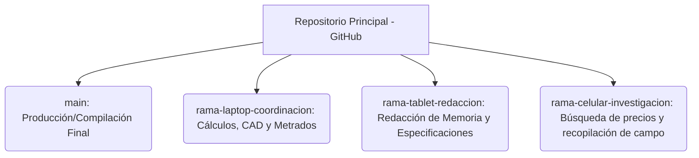

# Estructura del Repositorio Git
**Proyecto:** Instalación Eléctrica Domiciliaria - Vivienda Unifamiliar de 3 Pisos (Renzo Gabriel Mamani Galindo)
**Fecha:** 2026-06-10

A continuación se presenta la distribución y propósito de las ramas creadas en el repositorio remoto de GitHub para organizar el flujo de trabajo del proyecto según el dispositivo de acceso:

---

### Descripción de Ramas y Roles de Trabajo

| Rama | Dispositivo Asociado | Propósito / Actividades Principales | Estado |
| :--- | :---: | :--- | :---: |
| **`main`** | Servidor Principal | Contiene el expediente técnico consolidado, los planos definitivos y el reporte PDF final compilado listo para impresión. | **Vigente** |
| **`rama-laptop-coordinacion`** | Laptop | Coordinación técnica de cálculos, programación en Python de metrados, presupuesto, auto-enrutamiento CAD y compilación del compilador LaTeX. | **Vigente** |
| **`rama-tablet-redaccion`** | Tablet | Edición y redacción de los archivos `.tex` de especificaciones técnicas (Capítulos 3 y 4), memoria descriptiva (Capítulo 1), y correcciones ortográficas. | **Creada** |
| **`rama-celular-investigacion`** | Celular | Recopilación de fotos de campo, planos catastrales, comprobación de coordenadas GPS en Jr. Lima S/N, y consultas rápidas de precios de insumos en Sodimac/Promart. | **Creada** |

---

### Flujo de Integración Recomendado

1.  **Investigación y Precios:** Trabajar la información preliminar y fotos en `rama-celular-investigacion`.
2.  **Redacción de Textos:** Desarrollar los textos técnicos en `rama-tablet-redaccion`.
3.  **Coordinación e Integración:** Unificar todo, integrar planos DXF, programar metrados y compilar el PDF de LaTeX en `rama-laptop-coordinacion`.
4.  **Entrega Final:** Una vez verificado y probado que compila con cero errores, realizar el Pull Request (PR) y fusionar hacia `main`.
